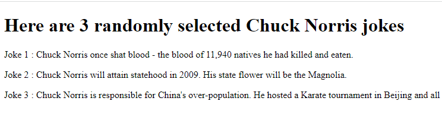

# HyperionDev Full Stack Web Development Bootcamp - Level 2 Task 7b - Advanced Javascript - Chuck Norris jokes

## Description
This is a quick website that uses an asyncronous function and "await" expressions to fetch 3 random Chuck Norris jokes from an API and display them on the page. The jokes are different every time the page loads. 

## Table of Contents
* [Instructions](#instructions)
* [Technologies](#technologies)
* [Installation](#installation)
* [Usage](#usage)
* [Credits](#credits) 

## Instructions
These were the instructions I was given to guide me in creating this website. 

Follow these steps:
* Create a website that will display three random Chuck Norris jokes. Use the API found here: http://www.icndb.com/api/. You can use this URL to fetch the jokes: http://api.icndb.com/jokes/random/3.

### Technologies
This project uses:
* HTML 5 
* Javascript ECMAScript 2021

## Installation
There is no special installation for this project. Simply open the [index.html](index.html) file in your web browser.

## Usage
To use this website, simply open the [index.html](index.html) file in your web browser. See figure 1 below.

### Credits
This website was created by Evan Malherbe during the HyperionDev Full Stack Web Development Bootcamp November 2021 [GitHub profile](https://github.com/evanmalherbe) 